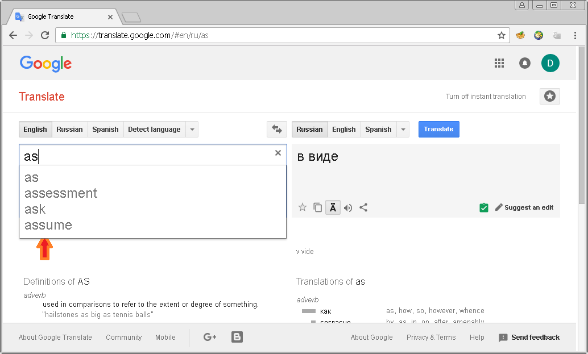
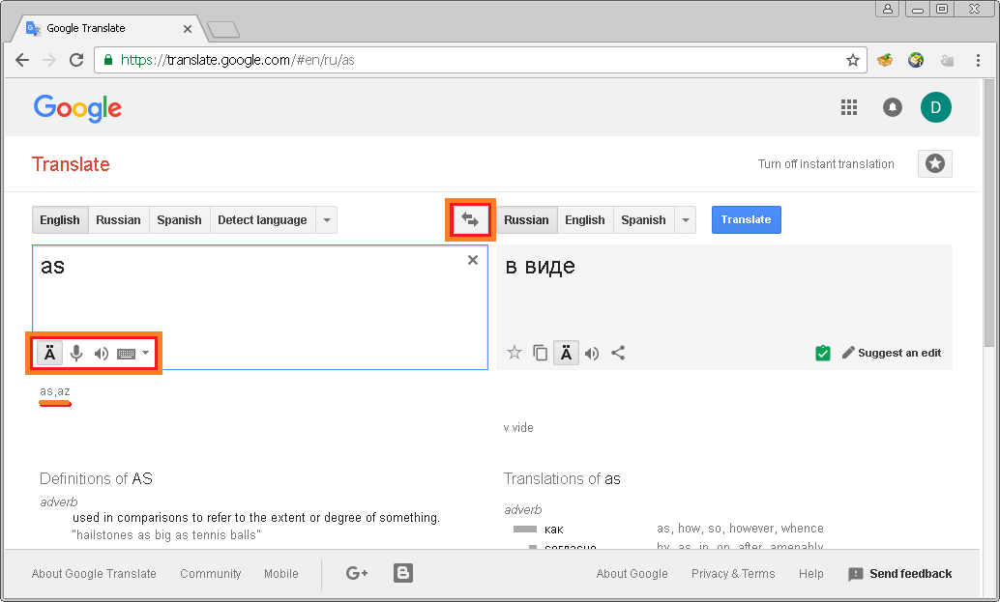
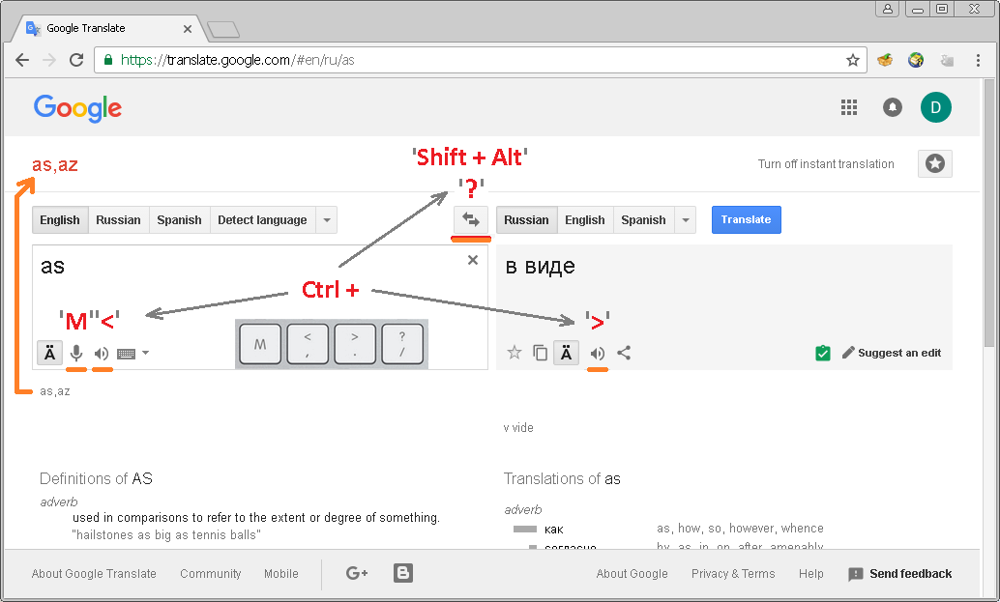
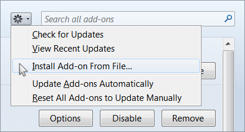

## What is GTA?

GTA is a free Google Translate Assistant extension for the Google Chrome and 
Mozilla Firefox browsers. The extension was specially designed to help with 
learning a foreign language using the Google Translate service. 


With this great service you can translate any words, phrases, clauses, 
sentences, and text from-to a lot of languages you want. As well as you can 
read transliteration and even listen prononciation of it. The service also acts 
like a dictionary when you've typed just a single word. In this case the service 
shows word's definitions, translation variations and even frequency of use. 
That's really cool. 

Let's look at the service more carefully. What's wrong with it? It's pretty 
nothing if you are accustomed to using your mouse. But what about if you want to 
use only keyboard to work with it? From this point of view it doesn't look very 
friendly. Let's see. 



When you start typing in any text Google immediately brings a list of suggestions 
to you. It's very useful. But there's a problem, you can't see phonetic notation 
(transcription) anymore and you aren't able to access the buttons - for example, 
to play pronunciation sounds - before you've pressed __Esc__ key to remove the 
suggestion list.



An another essential problem is that you can't switch languages without your 
mouse. But, what about if we might be able to see the transcription all the time 
and also have some useful keyboard shortcuts to switch languages, play 
pronunciation, etc? Sounds good? Well, let's go ahead.



After you has installed the GTA extension, you will be able to see the 
transliteration instead of the '__Translate__' header and have got the following 
shortcuts:

* **Ctrl + 'M'** - to activate/disactivate microphone;
* **Ctrl + ' , '** - to play the left side source text;
* **Ctrl + ' . '** - to play the right side result text;
* **Ctrl + ' / '** - to switch between languages;
* **Alt + Shift** - to switch languages and select text.

> **Note:** The **Alt + Shift** shortcut is more useful when you need to switch 
between your favorite languages in the Google service, because in such a way 
you can also switch between keyboard input languages and start typing with the 
different language immediately. Use the **Ctrl + ' / '** shortcut if you just 
need to switch languages in the service only.

And there're even more things. The extension will focus and select text in input 
language area when you would be switching between languages or application windows. 
So you will be able to type or paste new text just at once. For some English 
learners the utility can show phonetic notation used for their language. 


## How to install?

#### Google Chrome

You can have this extension installed only in **Developer mode** currently. 
To do that click the "__Customize and control Google Chrome__" button and select 
"__More tools -> Extensions__", then enable the "__Developer mode__" and 
press the "__Load unpacked extension__" button. Point the folder when you have 
downloaded this repository.


Finally, reload the Google Translate service page.

#### Mozilla Firefox

The installation on this browser is more complicated process. Because it requires 
an extension to be signed and there's no official way to get around this limitation 
since Firefox version 48.

So you can load this extension as a temporary add-on and you're going to need to 
reload it every time you're starting the browser. Or you can switch off the 
prohibition of loading of all unsigned extensions. And this is not a good way 
actually. Anyway, if you want you can do it.

To do that you have to switch value "__xpinstall.signatures.required__" to 
"__false__" on the browser Configuration page (__about:config__). And you also 
have to create a couple of files in Firefox directory. 

__/firefox_folder/config.js__:

```
try {
  Components.utils.import("resource://gre/modules/addons/XPIProvider.jsm", {})
  .eval("SIGNED_TYPES.clear()");
} catch(ex) {}
```

__/firefox_folder/defaults/pref/autoconfig.js__:

```
pref("general.config.obscure_value", 0);
pref("general.config.filename", "config.js");
```

After that, run the browser, open the browser Extensions page (__about:addons__) 
and use "__Install Add-on From File__" dialog to choose the extension file. 



To make this file just zip all the stuff of this repository and rename an archive 
to "__gtassistant.xpi__". 

## FAQ

#### Why isn't any customization of shortcuts provided?

The code is pretty simple, so you can change it as you need. Maybe in the next 
release.

#### Why is the developer mode needed to be used?

I haven't yet plans to post the utility on the Google or Mozilla stores. So I 
apologizing for this inconvenience.

#### Can you make support of English transcription for my native language?

Yes sure, just provide me with corresponding sound symbols for transcription. 
Feel free to email me or offer your pull request via GitHub. 
