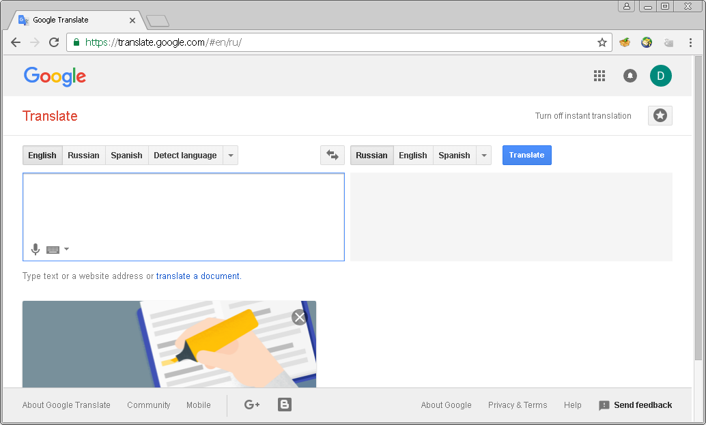
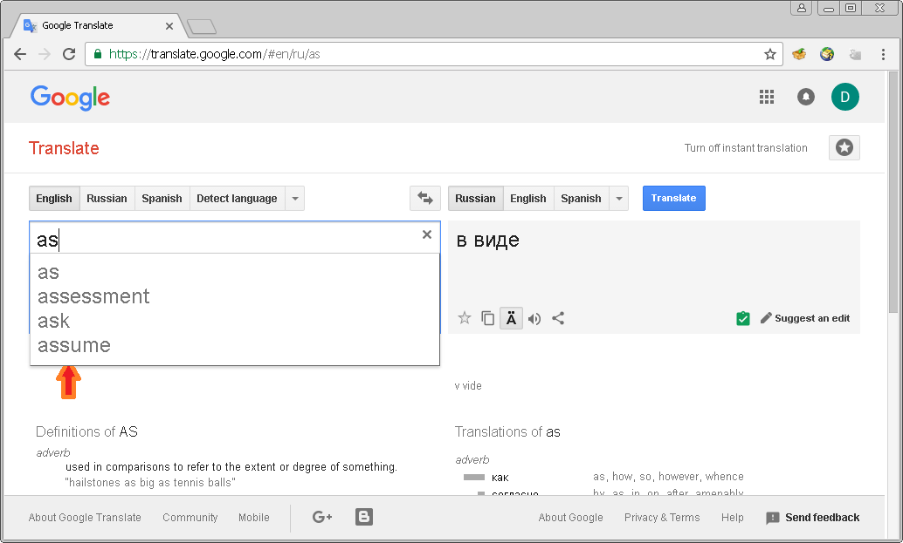
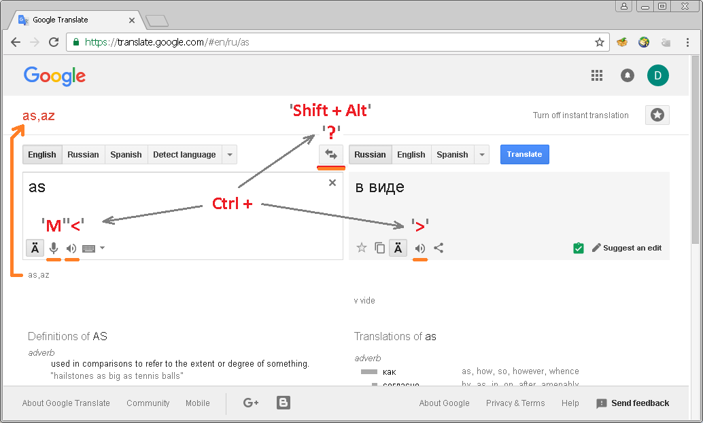
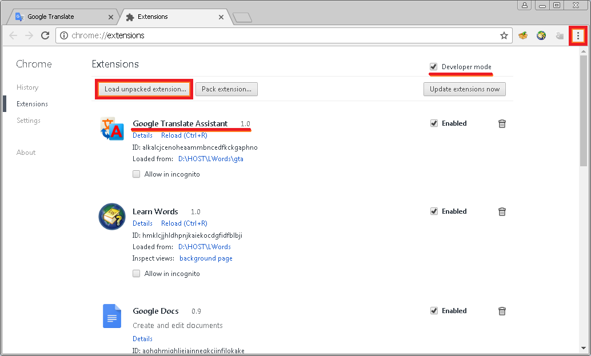

## What is GTA?

GTA is a Google Translate Assistant extension for the Google Chrome browser. 
The extension was specially designed to help with learning a foreign language 
using the great Google Translate service.

Let's look at the service more carefully. What's wrong with it? It's pretty 
nothing if you are using a mouse. So, what about if you want to use only 
keyboard to work with it? From this point of view it doesn't look very friendly.
But, why? Let's see.

When you start typing in any text Google immediately brings a list of suggestions 
to you. It's very useful. But, there's a problem, you can't see phonetic notation 
(transcription) anymore and you aren't able to access the buttons - for example, 
to play pronunciation sounds - before you've pressed __Esc__ key to remove the 
suggestion list.

An another essential problem is that you can't switch languages without your 
mouse. But, what about if we might be able to see the transcription all the time 
and also have some useful keyboard shortcuts to switch languages, play 
pronunciation, etc? Sounds good? Well, let's go ahead.

After you has installed the GTA extension, you will be able to see the 
transcription instead of the '__Translate__' header and get the following 
shortcuts:

* **Ctrl + 'M'** - to activate/disactivate microphone;
* **Ctrl + ' , '** - to play the left side source text;
* **Ctrl + ' . '** - to play the right side result text;
* **Ctrl + ' / '** - to switch between languages;
* **Alt + Shift** - to switch languages and select text.

> **Note:** The **Alt + Shift** shortcut is more useful when you need to switch 
between your favorite languages in the Google service, because in such a way 
you can also switch between keyboard input languages and start typing with the 
different language immediately. Use the **Ctrl + ' / '** shortcut if you just 
need to switch languages in the service only.

## How to install?

You can have this extension installed only in **Developer mode** currently. 
To do that click the "__Customize and control Google Chrome__" button and select 
"__More tools -> Extensions__", then enable the "__Developer mode__" and 
press the "__Load unpacked extension__" button. Point the folder when you have 
downloaded this repository.

Finally, reload the Google Translate service page.

## FAQ

**Why isn't any customization of shortcuts provided?**

The code is pretty simple, so you can change it as you need. Maybe in the next 
release.

**Why is the developer mode needed to be used?**

I haven't yet plans to post the utility on the Google store. So, apologizing for 
this inconvenience.
